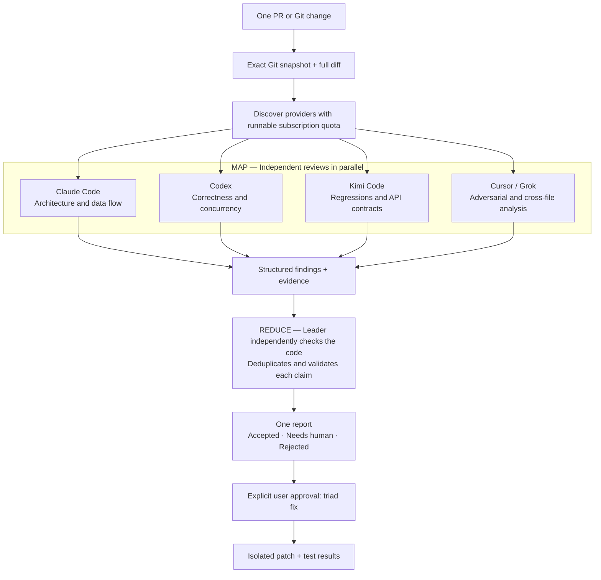

# Triad

Triad is a local Rust CLI that reviews one Git change with every available subscription-backed coding agent, consolidates the findings, and prepares a patch only after a separate approval command.

Triad is an independent project and is not affiliated with Anthropic, OpenAI, Moonshot AI, Cursor, or xAI.

## The idea: MapReduce for frontier-model intelligence

Make the most of the intelligence available through your existing AI subscriptions. Triad gives the same code change to several frontier models in parallel, then brings their findings together for an independent verification pass. The goal is to combine complementary reasoning and catch blind spots that a single reviewer might miss.



**Map:** Up to four reviewers, one per runnable provider, inspect the same full change in separate disposable snapshots. Different review focuses encourage complementary findings. If one provider runs out of quota, the others can continue and the report records reduced coverage.

**Reduce:** A configurable leader reads the findings and independently checks their evidence, reachable triggers, and impact against the code. Agreement between models is context, not proof; claims become `accepted`, `needs-human`, or `rejected` after verification.

**Act:** Review ends with a report. A separate `triad fix <run-id>` command authorizes an isolated patch and test results for accepted findings. The source checkout stays untouched.

## Why Triad

Large or risky changes are a poor fit for a single AI reviewer: one model can miss a cross-file regression, hallucinate a problem, or push its preferred architecture. Running several coding CLIs manually produces disconnected reports and repeated coordination work. Triad turns the subscription-backed agents you already use into one controlled review pipeline.

- **Broader coverage without API billing.** Triad discovers authenticated Claude Code, Codex, Kimi Code, and Cursor Agent subscriptions and fans review out to every provider whose observed quota state is runnable.
- **Independent perspectives, one verified report.** Every reviewer sees the same exact Git snapshot with a different focus. A separate leader reopens the code, verifies reachability and impact, deduplicates overlap, and classifies each claim instead of relying on majority voting.
- **High signal over architectural taste.** Findings must include a location, evidence, trigger, impact, and suggested fix. The reducer rejects speculative cleanup and overengineering when the change can safely ship as written.
- **Safe failure boundaries.** Reviewers run in disposable clones without a push remote, receive no vendor API-key environment variables, and are discarded if they mutate their snapshot. A provider quota or protocol failure degrades coverage without cancelling successful reviewers.
- **Human-controlled fixes.** Review stops at a report. Only a separate `triad fix` command creates an isolated patch and test results; it never commits, pushes, or changes the source checkout.
- **Usable for long reviews and CI.** Durable run manifests record exact revisions, providers, models, sessions, skipped coverage, and errors. Detached monitoring, resume/cancel commands, JSON output, and deterministic dry-run exit codes make the same workflow usable interactively or in CI.

Supported providers:

- Claude Code through an interactive `claude --bg` subscription session, pinned to `claude-fable-5-1` — never `claude -p` or Agent SDK usage.
- Codex CLI through ChatGPT login, pinned to `gpt-6-astra` with `max` reasoning and Standard processing; Fast mode is explicitly disabled.
- Kimi Code through membership login, pinned to `kimi-code/k3`.
- Cursor Agent through browser login, pinned to `grok-4.6-fast` (resolved to the current CLI model ID `cursor-grok-4.6-high-fast`).

Triad never reads vendor OAuth tokens and removes known API-key variables from every child process. Reviewers operate in independent disposable Git clones; the source checkout is not modified.

Cursor reviewers trust only the already-created disposable snapshot, run in read-only Ask mode with sandboxing enabled, and receive project-local deny rules for writes, secrets, destructive commands, network tools, and external CLIs. Global MCP servers are disabled for the run's snapshot and repository MCP configurations are replaced with empty run-local configs. The separately approved fixer allows writes only inside its disposable snapshot. Triad never passes Cursor `--force`, `-f`, or `--yolo`.

On macOS, Triad prefers the current official Codex binary bundled with ChatGPT over an older global `codex`; an explicit `[providers.codex].binary` still wins. Codex runs with `--ignore-user-config`, user hooks and Fast mode disabled, `service_tier="default"`, the explicit model/effort pair, ChatGPT subscription auth, and a role-appropriate sandbox. It never silently falls back to an older model. Triad requires CLI version `0.145.0` or later; model availability is determined by the provider.

Reviewers are strictly passive. Their prompts forbid editing or deleting files, commits, pushes, branches, tags, GitHub comments/reviews/issues, messages, deployments, and all other external actions. They may only inspect code, propose findings, and run existing local unit tests or read-only checks inside their disposable snapshots. Triad also removes each snapshot's Git remote, isolates Git/GitHub credentials, and discards any result whose snapshot files or HEAD changed.

Codex receives an additional anti-overengineering prompt at review, reduce, and fix stages: hypothetical reuse, extensibility, consistency, and textbook DRY are not findings, while valid issues are reduced to the smallest root-cause change that fits the existing design.

## Install

### Cargo

```bash
cargo install triad-harness
triad doctor --refresh
```

For development installs, clone the repository and run `cargo install --path .`.

### npm / npx

```bash
npx triad-harness --help
```

The npm launcher downloads the matching macOS or Linux release binary and verifies its SHA-256 checksum before execution.

### Homebrew

```bash
brew install nocell/tap/triad
```

The same formula supports Homebrew on macOS and Linuxbrew on x86_64 and ARM64.

### Debian / Ubuntu

Download the matching `.deb` from the GitHub Release, then install it locally:

```bash
sudo apt install ./triad-harness_VERSION_ARCH.deb
```

### Fedora / RHEL

Download the matching `.rpm` from the GitHub Release, then install it locally:

```bash
sudo dnf install ./triad-harness-VERSION-1.ARCH.rpm
```

Release archives and native packages contain statically linked musl binaries for Linux on x86_64 and ARM64. The project does not currently operate signed apt or yum repositories.

### Docker (x86_64 and ARM64)

The GHCR image contains Triad plus Claude Code, Codex CLI, Kimi Code CLI, Cursor Agent, Node.js, Python, and Rust. `edge` tracks `main`; version tags and `latest` are published from a release tag as one multi-platform manifest for `linux/amd64` and `linux/arm64`.

```bash
docker pull ghcr.io/nocell/triad-harness:edge
scripts/triad-docker doctor --refresh --json
scripts/triad-docker review --base origin/main
```

Build the same image locally with:

```bash
docker build --tag triad:local .
TRIAD_DOCKER_IMAGE=triad:local TRIAD_DOCKER_PULL=never scripts/triad-docker doctor --refresh
```

The wrapper mounts the selected Git checkout at `/workspace` read-only. Disposable snapshots, run artifacts, tool caches, and container-only login state live under `~/.local/share/triad/docker-home` by default. Existing `~/.claude`, `~/.codex`, `~/.kimi-code`, and `~/.cursor` directories are bind-mounted individually when present so browser/subscription login can be reused and refreshed. Override the source home with `TRIAD_DOCKER_CREDENTIALS_HOME`, the persistent container home with `TRIAD_DOCKER_HOME`, or the checkout with `TRIAD_DOCKER_WORKSPACE`.

The wrapper never mounts the whole host home, Docker socket, SSH agent, GitHub credentials, or vendor API-key environment variables. The image contains no credentials; `.dockerignore` allowlists only build inputs. It runs with the host UID/GID, a read-only root filesystem, all Linux capabilities dropped, and `no-new-privileges`.

Claude Code credentials created on macOS are stored in Keychain and cannot be bind-mounted into a Linux container. Run `scripts/triad-docker provider login claude` once; the Linux subscription credential is then persisted in the mounted `.claude` state. Missing Kimi or other provider directories work the same way. No login is started automatically.

Use foreground reviews in the ephemeral container. `scripts/triad-docker` rejects Triad's `--detach`, because Docker would stop the container as soon as the launcher process exits. Run `status`, `follow`, and `report` in later wrapper invocations against the persisted Triad state. Repository-specific test toolchains beyond the included Rust, Node.js, and Python environments can be added in a derived image.

Cursor CLI is currently optional. Triad will not install it without confirmation:

```bash
triad provider install cursor
triad provider install cursor --yes
triad provider login cursor
```

Vendor extra-usage or overage must be disabled in each account. Most providers do not expose an exact machine-readable remaining balance, so Triad records observed successes, quota failures, reset times, and cooldowns instead of pretending to know the balance.

## Review

```bash
# Current branch against the remote default branch
triad review

# Current branch against an explicit base
triad review --base origin/main

# GitHub PR from inside its repository
triad review 1234

# Staged, unstaged, and untracked changes
triad review --uncommitted

# Long-running detached review
triad review 1234 --detach
triad follow <run-id>
triad report <run-id>
```

`--providers auto` launches one reviewer for every runnable provider. Use `--require-all` to fail before model calls if any requested provider is unavailable. A quota failure produces a degraded report and updates the local circuit breaker.

### CI dry run

```bash
triad review --uncommitted --dry-run --json
```

`--dry-run` still consumes provider subscription usage and persists the report and run artifacts, but it terminates after reduction, never creates an approval/fix stage, and cannot be passed to `triad fix`. Exit code `0` means no `accepted` or `needs-human` findings, `2` means the review found a blocking issue, and `3` means a selected provider or the reducer failed. Missing optional providers are recorded as degraded coverage without failing an otherwise clean dry run; combine it with `--require-all` when CI requires every requested provider.

## Approval and fix

Review and fix are deliberately separate:

```bash
triad report <run-id>
triad fix <run-id>
triad fix <run-id> --only TRIAD-001,TRIAD-004
```

The fixer works in a fresh disposable checkout and writes `fix.patch` and `tests.json` into the run directory. It does not commit, push, or apply the patch to the source checkout.

## Provider and run management

```bash
triad providers
triad provider disable kimi
triad provider enable kimi
triad provider login claude

triad runs
triad status <run-id>
triad cancel <run-id>
triad resume <run-id> --detach
```

Data is stored with user-only permissions under the platform local-data directory. Override locations for hermetic automation with `TRIAD_CONFIG_HOME` and `TRIAD_DATA_HOME`.

## Sub-agent skills

Triad can install thin invocation skills. This is also confirmation-gated:

```bash
triad install-skill --host all
triad install-skill --host all --yes
```

The Codex skill is installed as `$triad` under `~/.codex/skills/triad`; use `/skills` to find it in Codex. It covers interactive reviews, CI dry runs, provider diagnostics, and approval-gated isolated fixes. The skills stop after the report and prohibit calling `triad fix` until the user separately approves the patch stage.

## Development

```bash
cargo fmt --check
cargo clippy --all-targets --all-features -- -D warnings
cargo test
```

The E2E suite uses four fake vendor CLIs. It exercises discovery, subscription-auth checks, parallel review, reducer selection, approval-gated fixing, API-key and GitHub-auth stripping, missing push remotes, protocol-violation rejection, and source-checkout isolation without consuming real model quota.

An optional scheduled/manual workflow also reviews a fixed reverse-diff fixture from `dtolnay/anyhow#420` through OpenRouter. It is a live model oracle, not a production Triad provider: production adapters remain subscription-only. The workflow never runs for pull requests and skips the model call unless `OPENROUTER_API_KEY` is configured as a GitHub Actions secret.
