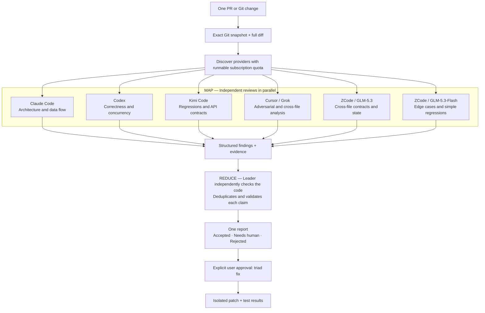

# Triad

To install, paste this prompt into your coding agent:

```plaintext
Install Triad and its skills for all supported agents by following these instructions: https://raw.githubusercontent.com/nocell/triad-harness/main/docs/install-skills-prompt.txt
```

Triad is a local Rust CLI that reviews one Git change with every available subscription-backed coding agent, consolidates the findings, and prepares a patch only after a separate approval command.

Triad is an independent project and is not affiliated with Anthropic, OpenAI, Moonshot AI, Cursor, xAI, or Z.ai.

## The idea: MapReduce for frontier-model intelligence

Make the most of the intelligence available through your existing AI subscriptions. Triad gives the same code change to several frontier models in parallel, then brings their findings together for an independent verification pass. The goal is to combine complementary reasoning and catch blind spots that a single reviewer might miss.


```mermaid
flowchart TB
    PR["One PR or Git change"] --> S["Exact Git snapshot + full diff"]
    S --> Q["Discover providers with runnable subscription quota"]

    subgraph MAP["MAP — Independent reviews in parallel"]
        C["Claude Code<br/>Architecture and data flow"]
        O["Codex<br/>Correctness and concurrency"]
        K["Kimi Code<br/>Regressions and API contracts"]
        G["Cursor / Grok<br/>Adversarial and cross-file analysis"]
        Z["ZCode / GLM-5.3<br/>Cross-file contracts and state"]
        ZF["ZCode / GLM-5.3-Flash<br/>Edge cases and simple regressions"]
    end

    Q --> C
    Q --> O
    Q --> K
    Q --> G
    Q --> Z
    Q --> ZF
    C --> F["Structured findings + evidence"]
    O --> F
    K --> F
    G --> F
    Z --> F
    ZF --> F
    F --> R["REDUCE — Leader independently checks the code<br/>Deduplicates and validates each claim"]
    R --> REPORT["One report<br/>Accepted · Needs human · Rejected"]
    REPORT --> APPROVE["Explicit user approval: triad fix"]
    APPROVE --> FIX["Isolated patch + test results"]
```

**Map:** Up to six reviewers across five vendor subscriptions inspect the same full change in separate disposable snapshots. The two ZCode providers run GLM-5.3 and GLM-5.3-Flash in parallel through the same Z.ai Coding Plan subscription. Different review focuses encourage complementary findings. If one provider runs out of quota, the others can continue and the report records reduced coverage.

**Reduce:** A configurable leader reads the findings and independently checks their evidence, reachable triggers, and impact against the code. Agreement between models is context, not proof; claims become `accepted`, `needs-human`, or `rejected` after verification.

**Act:** Review ends with a report. A separate `triad fix <run-id>` command authorizes an isolated patch and test results for accepted findings. The source checkout stays untouched.

## Why Triad

Large or risky changes are a poor fit for a single AI reviewer: one model can miss a cross-file regression, hallucinate a problem, or push its preferred architecture. Running several coding CLIs manually produces disconnected reports and repeated coordination work. Triad turns the subscription-backed agents you already use into one controlled review pipeline.

- **Broader coverage without API billing.** Triad discovers authenticated Claude Code, Codex, Kimi Code, Cursor Agent, and native ZCode subscriptions and fans review out to every provider whose observed quota state is runnable.
- **Independent perspectives, one verified report.** Every reviewer sees the same exact Git snapshot with a different focus. A separate leader reopens the code, verifies reachability and impact, deduplicates overlap, and classifies each claim instead of relying on majority voting.
- **High signal over architectural taste.** Findings must include a location, evidence, trigger, impact, and suggested fix. The reducer rejects speculative cleanup and overengineering when the change can safely ship as written.
- **Safe failure boundaries.** Reviewers run in disposable clones without a push remote, receive no vendor API-key environment variables, and are discarded if they mutate their snapshot. A provider quota or protocol failure degrades coverage without cancelling successful reviewers.
- **Human-controlled fixes.** Review stops at a report. Only a separate `triad fix` command creates an isolated patch and test results; it never commits, pushes, or changes the source checkout.
- **Usable for long reviews and CI.** Durable run manifests record exact revisions, providers, models, sessions, skipped coverage, and errors. Detached monitoring, resume/cancel commands, JSON output, and deterministic dry-run exit codes make the same workflow usable interactively or in CI.

Supported providers:

- Claude Code through an interactive `claude --bg` subscription session, pinned to `claude-fable-5-1` — never `claude -p` or Agent SDK usage.
- Codex CLI through ChatGPT login, pinned to `gpt-6-astra` with `max` reasoning and Standard processing by default; Ultra opts into `ultra` reasoning and Fast.
- Kimi Code through membership login, pinned to `kimi-code/k3`.
- Cursor Agent through browser login, pinned to `grok-4.7-fast` (resolved to the current CLI model ID `grok-4.7-high-fast`).
- ZCode through native Z.ai Coding Plan login, with separate `zcode` (`GLM-5.3`) and `zcode_flash` (`GLM-5.3-Flash`) reviewers. Both remain parallel reviewers in Default, Easy, and Ultra presets, subject to the same availability and explicit provider-selection rules.

ZCode integration targets the official CLI bundled with the desktop application; the macOS discovery candidate is `/Applications/ZCode.app/Contents/Resources/glm/zcode.cjs`. It requires native Z.ai Coding Plan authentication, not an API-key compatibility endpoint. Triad does not install ZCode or start login automatically. Discovery and fake-CLI tests do not establish live account authentication, model access, or inference success. The official fast model name is `GLM-5.3-Flash`; Instant is not a separately verified model, and Triad does not substitute FlashX.

ZCode runs with a restricted native account/model catalog, isolated session storage, plugins and MCP disabled, and shell/write/delegation tools denied. Unsafe inherited user hooks or settings requiring migration make it unavailable; Triad does not rewrite your global settings. The native home is retained because ZCode encrypts its own credentials using it. Read tools are not an OS-enforced filesystem sandbox: snapshot-only reads are an instruction boundary. ZCode currently supports review and reduction, not the separately approved fixer; automatic fixes choose another provider, and a pinned ZCode fixer fails closed. If the standalone CLI needs its own login, explicitly run `triad provider login zcode` once; both GLM reviewers share that native account.

The bundled CLI has no non-inference authentication-status command. ZCode therefore reports `subscription_pending`: Triad has locally validated the enforced Coding Plan-only route, not a valid login. Only these two adapters may defer authentication to the actual review task. A successful native account/model event confirms the manifest's auth source; failed login never falls back to API billing. `providers` and `doctor` do not submit `/model list` or another prompt as a probe.

If ZCode fails with `Select a model before continuing`, the native CLI has no selectable Coding Plan model; a desktop OAuth login alone may leave its standalone account connection incomplete. Run `triad provider login zcode` explicitly once for both GLM reviewers, then retry the review. Triad supplies the bundled catalog path during login, keeps model selection isolated, and leaves credential storage to ZCode. This failure is reported as unavailable/auth, not a quota cooldown or successful review. If login does not resolve it, check model access in the native CLI; do not copy tokens or switch to API billing.

Triad never reads vendor OAuth tokens and removes known API-key variables from every child process. Reviewers operate in independent disposable Git clones; the source checkout is not modified.

Cursor reviewers trust only the already-created disposable snapshot, run in read-only Ask mode with sandboxing enabled, and receive project-local deny rules for writes, secrets, destructive commands, network tools, and external CLIs. Global MCP servers are disabled for the run's snapshot and repository MCP configurations are replaced with empty run-local configs. The separately approved fixer allows writes only inside its disposable snapshot. Triad never passes Cursor `--force`, `-f`, or `--yolo`.

Triad does not enforce agent CLI version numbers. Versions are recorded for diagnostics, not used as compatibility gates. For Codex, discovery checks `exec --help` for the options the adapter actually needs (including config isolation, sandboxing and structured output); this does not make a model request or consume subscription quota. An older, prerelease or custom-versioned binary can work if it supports that interface. A missing option or failed capability check makes the provider unavailable with a diagnostic; Triad never drops safety flags to bypass incompatibility. Model availability and vendor-imposed minimum versions are still determined by the provider on real requests, without silent model fallback.

On macOS, Triad prefers the official Codex binary bundled with ChatGPT when it supports the required capabilities, otherwise it tries the global `codex`; an explicit `[providers.codex].binary` still wins and is checked without fallback. Codex runs with `--ignore-user-config`, user hooks disabled, the explicit model/effort pair, ChatGPT subscription auth, and a role-appropriate sandbox. Default/Easy use Standard (`service_tier="default"`, Fast disabled); Ultra explicitly enables Fast (`service_tier="fast"`).

Reviewers are strictly passive. Their prompts forbid editing or deleting files (including documentation, instructions, skills, and memory), commits, pushes, branches, tags, GitHub comments/reviews/issues, messages, deployments, and all other external actions. They may only inspect code, propose findings, and run supported existing local unit tests or read-only checks inside their disposable snapshots. They must not install dependencies, bootstrap environments, or create/update lockfiles to make a test run. Missing tools or dependencies are reported as limitations. Triad also removes each snapshot's Git remote, isolates Git/GitHub credentials, and discards any result whose snapshot files or HEAD changed.

Codex receives an additional anti-overengineering prompt at review, reduce, and fix stages: hypothetical reuse, extensibility, consistency, and textbook DRY are not findings, while valid issues are reduced to the smallest root-cause change that fits the existing design.

The lazy-senior policy means **thorough investigation and minimal fixes**, not shallow review. A meaningful medium-severity regression is worth reporting even if it need not block a merge. Findings need a reachable trigger, concrete impact, and code evidence; missing tests alone or speculative refactors do not qualify.

## Install

### Cargo

```bash
cargo install triad-harness
triad doctor --refresh
```

For development installs, clone the repository and run `cargo install --path .`.

### npm / npx

```bash
npx triad-harness --help
```

The npm launcher downloads the matching macOS or Linux release binary and verifies its SHA-256 checksum before execution.

### Homebrew

```bash
brew install nocell/tap/triad
```

The same formula supports Homebrew on macOS and Linuxbrew on x86_64 and ARM64.

### Debian / Ubuntu

Download the matching `.deb` from the GitHub Release, then install it locally:

```bash
sudo apt install ./triad-harness_VERSION_ARCH.deb
```

### Fedora / RHEL

Download the matching `.rpm` from the GitHub Release, then install it locally:

```bash
sudo dnf install ./triad-harness-VERSION-1.ARCH.rpm
```

Release archives and native packages contain statically linked musl binaries for Linux on x86_64 and ARM64. The project does not currently operate signed apt or yum repositories.

### Docker (x86_64 and ARM64)

The image defaults to Codex CLI `0.159.2` and checks the requested version during each architecture's build. This is a build default, not a runtime compatibility requirement; override `CODEX_CLI_VERSION` (or `CLAUDE_CODE_VERSION` / `KIMI_CODE_VERSION`) as a Docker build argument when needed. Native installs use the discovered local CLI; `triad providers` reports its path and version.

The GHCR image contains Triad plus Claude Code, Codex CLI, Kimi Code CLI, Cursor Agent, Node.js, Python, and Rust. `edge` tracks `main`; version tags and `latest` are published from a release tag as one multi-platform manifest for `linux/amd64` and `linux/arm64`.

```bash
docker pull ghcr.io/nocell/triad-harness:edge
scripts/triad-docker doctor --refresh --json
scripts/triad-docker review --base origin/main
```

Build the same image locally with:

```bash
docker build --tag triad:local .
TRIAD_DOCKER_IMAGE=triad:local TRIAD_DOCKER_PULL=never scripts/triad-docker doctor --refresh
```

The wrapper mounts the selected Git checkout at `/workspace` read-only. Disposable snapshots, run artifacts, tool caches, and container-only login state live under `~/.local/share/triad/docker-home` by default. Existing `~/.claude`, `~/.codex`, `~/.kimi-code`, and `~/.cursor` directories are bind-mounted individually when present so browser/subscription login can be reused and refreshed. Override the source home with `TRIAD_DOCKER_CREDENTIALS_HOME`, the persistent container home with `TRIAD_DOCKER_HOME`, or the checkout with `TRIAD_DOCKER_WORKSPACE`.

The wrapper never mounts the whole host home, Docker socket, SSH agent, GitHub credentials, or vendor API-key environment variables. The image contains no credentials; `.dockerignore` allowlists only build inputs. It runs with the host UID/GID, a read-only root filesystem, all Linux capabilities dropped, and `no-new-privileges`.

Claude Code credentials created on macOS are stored in Keychain and cannot be bind-mounted into a Linux container. Run `scripts/triad-docker provider login claude` once; the Linux subscription credential is then persisted in the mounted `.claude` state. Missing Kimi or other provider directories work the same way. No login is started automatically.

Use foreground reviews in the ephemeral container. `scripts/triad-docker` rejects Triad's `--detach`, because Docker would stop the container as soon as the launcher process exits. Run `status`, `follow`, and `report` in later wrapper invocations against the persisted Triad state. Repository-specific test toolchains beyond the included Rust, Node.js, and Python environments can be added in a derived image.

Cursor CLI is currently optional. Triad will not install it without confirmation:

```bash
triad provider install cursor
triad provider install cursor --yes
triad provider login cursor
```

Vendor extra-usage or overage must be disabled in each account. Most providers do not expose an exact machine-readable remaining balance, so Triad records observed successes, quota failures, reset times, and cooldowns instead of pretending to know the balance.

## Review

### Easy mode

```bash
triad review --base origin/main --easy-mode
triad providers --easy-mode --json
triad doctor --easy-mode --refresh
```

`--easy-mode` pins Claude to **Opus 5.5** (`claude-opus-5-5`) and Codex to
**GPT-6.1 Sol** (`gpt-6.1-sol`) for the run. It overrides those two configured
model IDs without changing your saved configuration. Kimi, Cursor, both ZCode reviewers, provider
selection, reasoning effort (Codex defaults to `max`), and Standard processing
(Fast mode off) are unchanged. Without this flag, the existing Fable 5.1 / Astra
defaults and your configured model overrides still apply.

The preset is recorded in the run manifest and survives detached execution,
`resume`, reduction, and a separately approved `triad fix <run-id>`. It also
works with `--dry-run`; neither mode is quota-free. Unavailable models do not
silently fall back to another model or API billing.

Model IDs: [Claude models](https://platform.claude.com/docs/en/models/overview),
[GPT-6.1 Sol](https://developers.openai.com/api/docs/models/gpt-6.1-sol).

### Ultra mode

```bash
triad review --base origin/main --ultra-mode --detach
triad providers --ultra-mode --json
triad doctor --ultra-mode --refresh
```

`--ultra-mode` is an opt-in run-local preset, mutually exclusive with `--easy-mode`:

| Provider | Ultra configuration |
| --- | --- |
| Claude | Opus 5.5 (`claude-opus-5-5`), Ultracode workflows, `xhigh` effort; Claude Fast stays off |
| Codex | GPT-6 Astra (`gpt-6-astra`), reasoning `ultra`, ordinary Fast (`service_tier="fast"`) — not Ultrafast |
| Kimi / Cursor / ZCode / ZCode Flash | Unchanged; both GLM models remain parallel reviewers |

Saved configuration, provider selection and the separate fix approval gate are unchanged.
The preset survives detach, resume, reduction and fix, and also applies to `--dry-run`
(which still makes model calls). Codex capability checks require `--enable` only when
Fast is requested; no agent version is pinned and no inference probe is made.

Claude runs a background subscription session with run-local Ultracode/workflow settings.
Reviewers and reducers may orchestrate read-only checks using inline `Workflow` scripts;
their child agents inherit deny rules for writes, shell commands and external actions.
Triad requires a session-specific Ultracode-on reminder and a successful Workflow launch
in the session transcript before accepting Claude's output. Missing/unsupported Ultracode
is reported as a provider failure with degraded coverage, never as a silent ordinary-Opus
fallback. `--require-all` requires every selected provider to pass discovery; a runtime
provider failure still degrades coverage without discarding other reviewers. This activation
check is not independent proof that every workflow child completed successfully.
Account/policy support
can only be established during a real task, not from `doctor` authentication checks.

This mode uses subscription quota faster. Codex Fast consumes included limits at **2.5×**
Standard; Claude workflow subagents also consume the subscription quota. Availability
depends on the provider plan and policy. Keep account extra usage disabled; Triad never
enables overage or API billing. See [Codex speed modes](https://learn.chatgpt.com/docs/agent-configuration/speed)
and [Claude workflows](https://code.claude.com/docs/en/workflows).

```bash
# Current branch against the remote default branch
triad review

# Current branch against an explicit base
triad review --base origin/main

# GitHub PR from inside its repository
triad review 1234

# Staged, unstaged, and untracked changes
triad review --uncommitted

# Long-running detached review
triad review 1234 --detach
triad follow <run-id>
triad report <run-id>
```

`--providers auto` launches one reviewer for every runnable provider. Use `--require-all` to fail before model calls if any requested provider is unavailable. A quota failure produces a degraded report and updates the local circuit breaker.

Claude background sessions require workspace trust. Triad records trust for each
exact disposable clone in Claude's local project state, without trusting the source
checkout or parent directories. It preserves the rest of the Claude configuration
under the same file lock Claude uses. Sessions load only Triad's explicit settings
and agent definition; repository and user settings are not inherited. Reviewer
status and quota failures are saved as each provider finishes, while other reviewers
continue.

### Review packet and evidence boundaries

Each reviewer and reducer receives the same before/after evidence in its own
disposable snapshot:

```text
.triad-review/
  packet.json         # exact revisions, asset sizes and SHA-256 hashes
  context.md          # target revisions, scope, and review instructions
  review.diff         # full diff of the captured target
  changed-files.json  # changed-path index
  before/             # available base versions of changed files
  after/              # frozen changed versions
```

Current versions remain in the snapshot. The packet is generated from the
captured target, not a moving branch, and treated as immutable review input.
Triad validates packet and diff availability before provider calls; missing,
unreadable, or inconsistent evidence fails setup rather than becoming a clean
review. Reviewers can use their read tools directly, without needing shell
access to `git diff`. Binary files, deletions, and unavailable evidence still
need explicit attention; a packet does not guarantee every behavior is testable.

Every provider receives the same explicit JSON output contract. Reviewer and
reducer responses include `review_status` (`complete` or `incomplete`),
`limitations`, and `findings`. Triad validates these responses locally: missing
required fields or an invalid verdict are errors, never clean reviews. An empty
`findings` array with incomplete analysis is **not** a clean verdict. Failed or
incomplete reduction produces an explicit incomplete report, exits with code
`3`, and cannot enter the fix stage.

Valid partial findings are not discarded: incomplete reviewers' candidates and
limitations reach Reduce without counting as complete coverage. If reduction
itself is incomplete, its candidates remain explicitly unverified `needs-human`
items alongside the saved reviewer evidence. Missing context never becomes a
claim that the code is clean.

Tests depend on each adapter's capabilities. Read-only Claude and ZCode sessions
must not claim shell/test execution; other reviewers may run supported existing
tests without modifying source or preparing a new environment. Reports distinguish
limitations and agent-reported test results from independently observed checks.

After Map finishes, `triad resume <run-id> --json` retries reduction using saved
reviewer results and the original base/head and provider cohort, without repeating successful model
calls or switching to the latest PR revision. Start a new review to review a new
revision. If Map itself was interrupted before the checkpoint, resume still
restarts Map. Historical reports are not rewritten automatically.

During provider calls, the worker refreshes its heartbeat every ten seconds.
`review --detach --json` and `resume --detach --json` return a JSON object with
`run_id` and `pid`; without `--json`, detached commands print the run ID.
Provider logs retain full secret-redacted output, while diagnostics remain bounded.

Use one monitor per run: `triad follow <run-id> --interval 30` prints plain-text
progress only when it changes, or check `triad status <run-id> --json` as needed.
Avoid a second parallel polling loop or repeated full JSON manifests. A finished
normal review requires `awaiting_approval`, a reducer report, and no run error;
dry runs finish at `completed`. Always inspect completeness and degraded coverage
before interpreting an empty findings list. Follow-up requests should reuse the
same run; changed revisions require a new review.

Repeated quota errors without a reported reset use an observed exponential
cooldown (15, 30, 60 minutes, up to six hours with the default configuration).
This is a retry policy, not an estimate of remaining quota or the reset time.
An exact provider-reported reset wins; success or manual provider enable resets
the backoff. No model probes are used.

### CI dry run

```bash
triad review --uncommitted --dry-run --json
```

`--dry-run` still consumes provider subscription usage and persists the report and run artifacts, but it terminates after reduction, never creates an approval/fix stage, and cannot be passed to `triad fix`. Exit code `0` means no `accepted` or `needs-human` findings, `2` means the review found a blocking issue, and `3` means a selected provider or the reducer failed. Missing optional providers are recorded as degraded coverage without failing an otherwise clean dry run; combine it with `--require-all` when CI requires every requested provider.

## Approval and fix

Review and fix are deliberately separate:

```bash
triad report <run-id>
triad fix <run-id>
triad fix <run-id> --only TRIAD-001,TRIAD-004
```

The fixer works in a fresh disposable checkout and writes `fix.patch` and `tests.json` into the run directory. It does not commit, push, or apply the patch to the source checkout.

If the fixer reports a failed test or a malformed test report, the run ends as
`fix_incomplete` (exit `3`) and preserves its patch for inspection. A patch alone
does not prove verification. Tests recorded as `not_run` remain visible in
`tests.json`; Triad does not independently certify an agent's test claims.

## Provider and run management

```bash
triad providers
triad provider disable kimi
triad provider enable kimi
triad provider login claude

triad runs
triad status <run-id>
triad cancel <run-id>
triad resume <run-id> --detach
```

Data is stored with user-only permissions under the platform local-data directory. Override locations for hermetic automation with `TRIAD_CONFIG_HOME` and `TRIAD_DATA_HOME`.

## Sub-agent skills

Triad can install thin invocation skills. This is also confirmation-gated:

```bash
triad install-skill --host all
triad install-skill --host all --yes

# Optional second skill, alongside the normal one:
triad install-skill --host all --easy-mode --yes

# Optional Ultra skill, without replacing the other two:
triad install-skill --host codex --ultra-mode --yes
```

The Codex skill is installed as `$triad` under `~/.codex/skills/triad`; use `/skills` to find it in Codex. It covers interactive reviews, CI dry runs, provider diagnostics, and approval-gated isolated fixes. The skills stop after the report and prohibit calling `triad fix` until the user separately approves the patch stage.

The separate `$triad-easy` skill (Claude Code: `/triad-easy`) always starts reviews with `--easy-mode`: Claude Opus 5.5 and GPT-6.1 Sol, with Kimi/Cursor and both parallel ZCode models unchanged. It installs under each host's `skills/triad-easy` directory without replacing the regular `triad` skill. Both skills are standalone and share the same passive-review and approval rules.

The standalone `$triad-ultra` skill appears as **Triad Ultra** in Codex and uses `--ultra-mode`: Claude Opus 5.5 with Ultracode plus GPT-6 Astra with `ultra` reasoning and ordinary Fast processing, not Ultrafast. It installs to `skills/triad-ultra`; use `--host all` for the other supported hosts too. Easy and Ultra installation flags are mutually exclusive. All three skills keep the same approval boundaries.

`--host all` writes all three skill directories, even if an agent is not installed yet. It does not install the agent applications. Cursor participates as a review provider, but the built-in skill installer does not currently install a Cursor skill. Re-running the command refreshes the skills from the installed Triad version, not from GitHub; update Triad first when you want newer skill instructions.

## Development

```bash
cargo fmt --check
cargo clippy --all-targets --all-features -- -D warnings
cargo test
```

The E2E suite uses fake vendor CLIs. It exercises discovery, subscription-auth checks, parallel review, reducer selection, approval-gated fixing, API-key and GitHub-auth stripping, missing push remotes, protocol-violation rejection, and source-checkout isolation without consuming real model quota. Fake-CLI coverage does not prove live provider authentication or model availability.

The packet suite checks committed and uncommitted inputs, renames/deletions, binary
files, symlinks, missing/corrupt assets, tampering, and checkpoint recovery. The
subscription E2E fixture has both a known boundary bug and a behavior-preserving
change to catch false positives:

```bash
# CI-safe fixture validation: no model requests or subscription usage.
node scripts/e2e-subscriptions.mjs --fixtures-only

# Opt-in live test: uses existing native subscription logins and consumes quota.
cargo build --locked
TRIAD_BIN="$PWD/target/debug/triad" node scripts/e2e-subscriptions.mjs
# Or limit the live test to selected providers:
TRIAD_BIN="$PWD/target/debug/triad" node scripts/e2e-subscriptions.mjs --providers codex,zcode,zcode_flash
# Re-run just one scenario without repeating the other model calls:
TRIAD_BIN="$PWD/target/debug/triad" node scripts/e2e-subscriptions.mjs --scenario clean
```

Live testing makes no installation, login, publication, or fix requests. It checks
each completed reviewer's findings, the reducer verdict, frozen revision metadata,
and the untouched source checkout. It prints unavailable/failed providers as
degraded coverage and exits `3`; passing reviewers do not prove the skipped providers work.
Triad's `--dry-run` still runs inference: only `--fixtures-only` avoids model calls.

An optional scheduled/manual workflow also reviews a fixed reverse-diff fixture from `dtolnay/anyhow#420` through OpenRouter. It is a live model oracle, not a production Triad provider: production adapters remain subscription-only. The workflow never runs for pull requests and skips the model call unless `OPENROUTER_API_KEY` is configured as a GitHub Actions secret.
